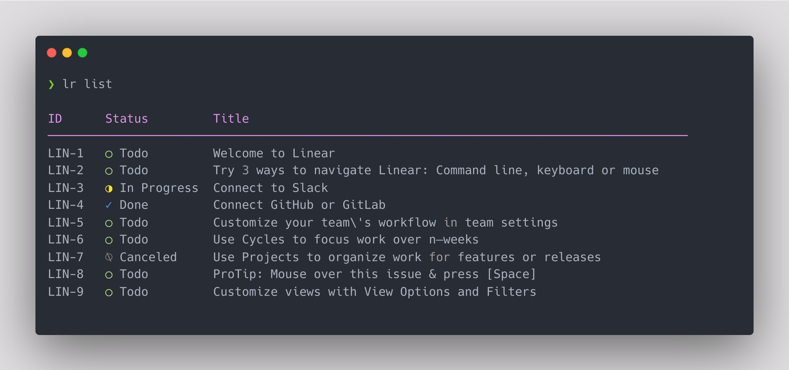

## Linear CLI

A CLI for [Linear](https://linear.app/) that allows you to quickly view, create and update issues.

[](https://oclif.io)
[](https://npmjs.org/package/@egcli/lr)
[](https://npmjs.org/package/@egcli/lr)
[](https://github.com/egodon/linear-cli/blob/master/package.json)



# Installation

###### Install with npm

```
  $ npm install -g @egcli/lr
```

###### Install with yarn

```
  $ yarn global add @egcli/lr
```

###### Setup API key

```
  $ lr init
```

# Commands

<!-- commands -->

- [`lr cache:refresh`](#lr-cacherefresh)
- [`lr cache:show`](#lr-cacheshow)
- [`lr config:delete`](#lr-configdelete)
- [`lr config:show`](#lr-configshow)
- [`lr init`](#lr-init)
- [`lr issue ISSUEID`](#lr-issue-issueid)
- [`lr issue:create`](#lr-issuecreate)
- [`lr issue:list`](#lr-issuelist)
- [`lr issue:search [QUERY]`](#lr-issuesearch-query)
- [`lr issue:start ISSUEID`](#lr-issuestart-issueid)
- [`lr issue:stop ISSUEID`](#lr-issuestop-issueid)
- [`lr issue:update ISSUEID`](#lr-issueupdate-issueid)
- [`lr teams:show`](#lr-teamsshow)
- [`lr workspace:add`](#lr-workspaceadd)
- [`lr workspace:current`](#lr-workspacecurrent)
- [`lr workspace:switch`](#lr-workspaceswitch)

## `lr cache:refresh`

Refresh the cache

```
USAGE
  $ lr cache:refresh
```

_See code: [src/commands/cache/refresh.ts](https://github.com/evangodon/linear-cli/blob/v0.17.0/src/commands/cache/refresh.ts)_

## `lr cache:show`

Print the cache file

```
USAGE
  $ lr cache:show

OPTIONS
  -p, --pretty  Pretty print
```

_See code: [src/commands/cache/show.ts](https://github.com/evangodon/linear-cli/blob/v0.17.0/src/commands/cache/show.ts)_

## `lr config:delete`

```
USAGE
  $ lr config:delete
```

_See code: [src/commands/config/delete.ts](https://github.com/evangodon/linear-cli/blob/v0.17.0/src/commands/config/delete.ts)_

## `lr config:show`

```
USAGE
  $ lr config:show
```

_See code: [src/commands/config/show.ts](https://github.com/evangodon/linear-cli/blob/v0.17.0/src/commands/config/show.ts)_

## `lr init`

Setup the Linear cli

```
USAGE
  $ lr init
```

_See code: [src/commands/init.ts](https://github.com/evangodon/linear-cli/blob/v0.17.0/src/commands/init.ts)_

## `lr issue ISSUEID`

Show issue info

```
USAGE
  $ lr issue ISSUEID

OPTIONS
  -c, --comments     Show issue comments
  -d, --description  Show issue description
  -o, --open         Open issue in web browser

ALIASES
  $ lr i

EXAMPLES
  $ lr issue LIN-14
  $ lr issue LIN 14
  $ lr issue 14 (looks in default team)
```

_See code: [src/commands/issue/index.ts](https://github.com/evangodon/linear-cli/blob/v0.17.0/src/commands/issue/index.ts)_

## `lr issue:create`

Create a new issue

```
USAGE
  $ lr issue:create

OPTIONS
  -c, --copy  Copy issue url to clipboard after creating

ALIASES
  $ lr create
  $ lr c
```

_See code: [src/commands/issue/create.ts](https://github.com/evangodon/linear-cli/blob/v0.17.0/src/commands/issue/create.ts)_

## `lr issue:list`

List issues

```
USAGE
  $ lr issue:list

OPTIONS
  -a, --all               List issues from all teams
  -m, --mine              Only show issues assigned to me
  -s, --status=status     Only list issues with provided status
  -t, --team=team         List issues from another team
  -u, --uncompleted       Only show uncompleted issues
  -x, --extended          show extra columns
  --columns=columns       only show provided columns (comma-separated)
  --csv                   output is csv format [alias: --output=csv]
  --filter=filter         filter property by partial string matching, ex: name=foo
  --no-header             hide table header from output
  --no-truncate           do not truncate output to fit screen
  --output=csv|json|yaml  output in a more machine friendly format
  --sort=sort             [default: -status] property to sort by (prepend '-' for descending)

ALIASES
  $ lr list
  $ lr ls
  $ lr l
```

_See code: [src/commands/issue/list.ts](https://github.com/evangodon/linear-cli/blob/v0.17.0/src/commands/issue/list.ts)_

## `lr issue:search [QUERY]`

describe the command here

```
USAGE
  $ lr issue:search [QUERY]

ALIASES
  $ lr search
  $ lr s
```

_See code: [src/commands/issue/search.ts](https://github.com/evangodon/linear-cli/blob/v0.17.0/src/commands/issue/search.ts)_

## `lr issue:start ISSUEID`

Change status of issue to "In progress" and assign to yourself.

```
USAGE
  $ lr issue:start ISSUEID

OPTIONS
  -c, --copy-branch  copy git branch to clip-board

ALIASES
  $ lr start
  $ lr s
```

_See code: [src/commands/issue/start.ts](https://github.com/evangodon/linear-cli/blob/v0.17.0/src/commands/issue/start.ts)_

## `lr issue:stop ISSUEID`

Return issue to preview state

```
USAGE
  $ lr issue:stop ISSUEID

OPTIONS
  -u, --unassign  Unassign issue from yourself

ALIASES
  $ lr stop
```

_See code: [src/commands/issue/stop.ts](https://github.com/evangodon/linear-cli/blob/v0.17.0/src/commands/issue/stop.ts)_

## `lr issue:update ISSUEID`

Update an issue

```
USAGE
  $ lr issue:update ISSUEID

OPTIONS
  -p, --property=title|description|status  Property to modify

ALIASES
  $ lr update
  $ lr u
```

_See code: [src/commands/issue/update.ts](https://github.com/evangodon/linear-cli/blob/v0.17.0/src/commands/issue/update.ts)_

## `lr teams:show`

Show teams in this workspace

```
USAGE
  $ lr teams:show

OPTIONS
  -m, --mine  Pretty print
```

_See code: [src/commands/teams/show.ts](https://github.com/evangodon/linear-cli/blob/v0.17.0/src/commands/teams/show.ts)_

## `lr workspace:add`

Add a new workplace

```
USAGE
  $ lr workspace:add
```

_See code: [src/commands/workspace/add.ts](https://github.com/evangodon/linear-cli/blob/v0.17.0/src/commands/workspace/add.ts)_

## `lr workspace:current`

Print current workspace

```
USAGE
  $ lr workspace:current
```

_See code: [src/commands/workspace/current.ts](https://github.com/evangodon/linear-cli/blob/v0.17.0/src/commands/workspace/current.ts)_

## `lr workspace:switch`

Switch to another workspace

```
USAGE
  $ lr workspace:switch
```

_See code: [src/commands/workspace/switch.ts](https://github.com/evangodon/linear-cli/blob/v0.17.0/src/commands/workspace/switch.ts)_

<!-- commandsstop -->

# ZSH completions

If you want to add completions for the `lr` command and you're using ZSH you can do the following:

```sh
# 1. Clone this repository
> git clone https://github.com/evangodon/linear-cli
> cd linear-cli

# 2. On Arch Linux you can do
sudo cp zsh-completions/_lr /usr/share/zsh/site-functions/

# 3. Open a new terminal an enjoy the completions :)
```
